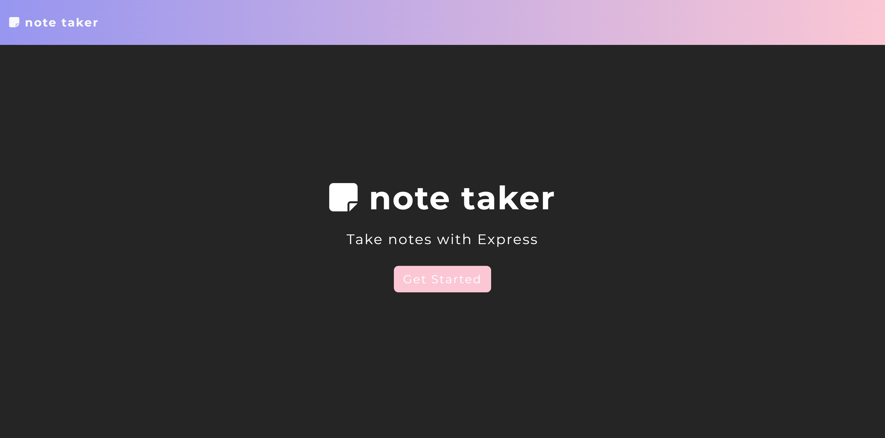
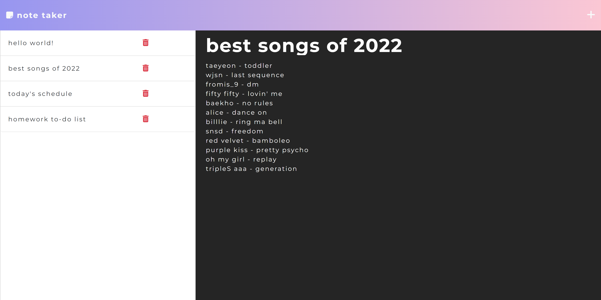

# Note Taker

 
 
 
 


## Description

Note Taker is an application that uses Express.js to write, save, & retrieve notes
from a JSON file. Users can write their notes, save them, & delete them with ease. 
In addition, this application has a light-weight, eye-catching, user-friendly interface.
Try it yourself!


## Table of Contents

- [Screenshot](#Screenshot) 
- [Installation](#Installation) 
- [Questions](#Questions) 
- [Heroku](#Heroku) 
- [License](#License)


## Screenshot

When opening Note Taker, the user will be greeted with this landing page




Create a new note by pressing the + at the top-right corner of the nav bar.
Write a note in where placeholder text is, press the floppy disk icon to save.
View past notes by clicking them in the left-hand bar. 
Press the trash icon next any specific note to delete it. 
You can also edit past notes by saving a separate copy. It will not overwrite the original
so the user can delete it if they please.




## Installation

This application requires VS Code, Node.js, & Express.js.

To install this application for local development, install the require packages, use the following command:

```
npm i
```

Once installation is done, use the following command:

```
npm start
```
    

## Questions

Got any questions about this application? Contact me!

Github: 
🔗 https://github.com/kirbyfridge/

Email: 
🔗 05.01.aah@gmail.com


## Heroku

You can view the deployed application at the link below. 

🔗 insert link here


## License

    This application is covered by the MIT license.